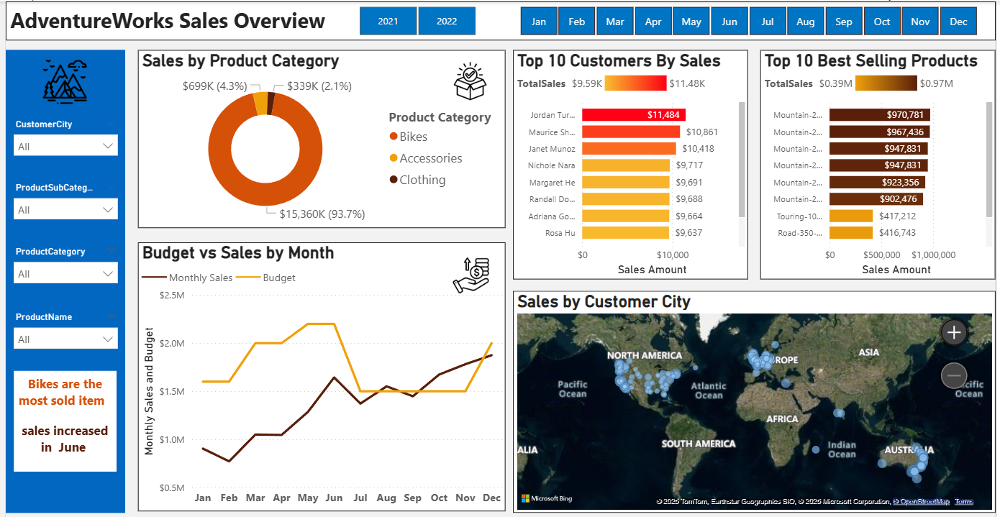

# Portfolio Project 1 - SQL and PowerBI - AdventureWorks

In this data cleaning, analysis and visualisation project, I clean the AdventureWorks dataset with SQL, then visualise it as an interactive 3-page dashboard with PowerBI.

**Page 1 - AdventureWorks Sales Overview**

**Page 2 - Sales by Customer**

**Page 3 - Sales by Product**

**Future Project Aim**

In addition to SQL and R, I have now started learning Python. Once I improve my Python knowledge sufficiently, I aim to set up and automate this process as a system, where data is pulled from a database, cleaned and organised into a format suitable for visualisation, visualised in a dashboard, the dashboard is exported as a PDF and the PDF is emailed to concerned stakeholders automatically.

The entire process should be autonomous and require almost zero human attention, with the exception of regular checks to verify the proper functioning of the process and the accuracy of the results.

Statement to self - New Year's Resolution: As of January 2023, I intend to achieve this level of proficiency in Python (and if possible, complete this full project and upload here to GitHub) at most within the end of 2023, allowing for unforeseen constraints, though I hope to achieve it sooner.
